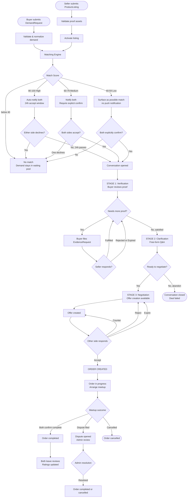
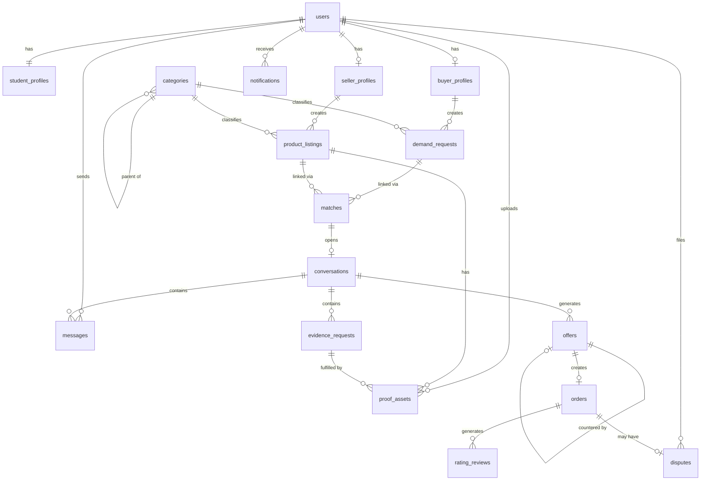

# Student Secondhand Marketplace — System Design Rules

---

## Preliminary: Model Adjustments

Three adjustments from the original concept are applied throughout this document:

**Adjustment 1 — Bidirectional matching.** Matching runs in both directions: a new DemandRequest scans existing ProductListings, and a new ProductListing scans existing DemandRequests. Both trigger match creation.

**Adjustment 2 — Platform mediates, does not process payments (MVP).** In-platform payment is deferred. Orders are formal agreement records; money exchange happens physically. Completion is tracked via mutual confirmation.

**Adjustment 3 — Dual-role user model.** A student can be buyer and seller simultaneously. BuyerProfile and SellerProfile are separate objects linked to one User, both optionally populated.

---

## 1. Product Assumptions

### Business Concept

A university-exclusive, C2C secondhand marketplace where the platform actively mediates transactions rather than passively hosting listings. A demand-supply matching engine connects buyer intent with seller supply, followed by a structured verification and negotiation workflow. The platform replaces fragmented social channels (Facebook groups, WhatsApp) with a purpose-built, trust-enforced system.

### Marketplace Classification

| Dimension | Classification |
|-----------|---------------|
| Model | C2C (consumer-to-consumer) |
| Direction | Demand-driven primary, supply-driven secondary |
| Scope | University campus(es) |
| Transaction mediation | Platform-mediated, offline payment (MVP) |
| Trust model | Proof-based, identity-verified |
| Matching | Automated scoring, human confirmation |
| Conversation | Guided/staged, not free-form |

### Main User Roles

- **Buyer** — posts structured demand requests, browses matches, requests proof, makes or responds to offers.
- **Seller** — posts product listings with initial proof, receives demand matches, provides additional evidence, makes or responds to offers.
- **Dual-role user** — a single student account operating as both buyer and seller simultaneously on different items.
- **Platform Admin** — configures categories, reviews flagged content, resolves disputes, manages verification.
- **Moderator** — (Phase 2) peer moderator with limited admin rights; handles report queues.

### Operational Assumptions

- Access restricted to students with a verified university email address or student ID.
- MVP operates on one campus or a small set of partner campuses.
- Platform does not process payments; it creates a formal order record only.
- Physical meetup or agreed delivery is arranged through the platform's conversation system but executed offline.
- All listings and demand requests expire after a configurable period (default: 30 days).
- The platform stores all proof assets (photos, videos) directly; no external links accepted as primary proof.
- Matching runs automatically on creation of any DemandRequest or ProductListing.
- The system is mobile-first; all flows must be completable on a phone.

---

## 2. Actors and User Types

| Actor | Type | Responsibilities |
|-------|------|-----------------|
| Buyer | Human, student | Submit demand requests; review matches; request evidence; create or respond to offers; confirm order completion; leave reviews |
| Seller | Human, student | Submit product listings with proof; receive match notifications; respond to evidence requests; create or respond to offers; confirm order completion; leave reviews |
| Dual-role User | Human, student | Both of the above, simultaneously on different transactions |
| Platform Admin | Human, staff | Manage category taxonomy; resolve disputes; override system decisions; verify edge-case student identities; configure rules |
| Matching Engine | Automated system | Normalize demand and supply data; compute match scores; create Match records; trigger notifications |
| Verification Agent | Automated + manual | Run proof quality checks (image clarity, completeness); flag insufficient proof; escalate to admin when needed. MVP: mostly rules-based with manual admin review for flagged cases |
| Notification System | Automated | Dispatch in-app, email, and push notifications at system-defined trigger points |
| Content Moderation | Automated + manual | Flag prohibited items, inappropriate language, fake proof. MVP: keyword filter + admin report queue |

---

## 3. Core Objects / Domain Model

### User

**Purpose:** Central identity record for every person on the platform.

| Field | Type | Notes |
|-------|------|-------|
| id | UUID | Primary key |
| email | String | University email, unique |
| email_verified | Boolean | Must be true before any activity |
| name | String | Display name |
| phone | String | Optional, used for order coordination |
| created_at | Timestamp | |
| status | Enum | active, suspended, banned |
| last_active_at | Timestamp | Used for inactivity detection |

**Relationships:** Has one StudentProfile; has zero or one BuyerProfile; has zero or one SellerProfile; receives many Notifications.

**Constraints:** Email must match an allowed university domain list. Cannot transact until email_verified = true.

---

### StudentProfile

**Purpose:** Stores identity verification data separate from the User record to allow re-verification without changing core identity.

| Field | Type | Notes |
|-------|------|-------|
| id | UUID | |
| user_id | FK → User | |
| university | String | Derived from email domain or explicit selection |
| student_id_number | String | Optional |
| student_id_asset | FK → ProofAsset | Photo of student ID, optional |
| verification_status | Enum | unverified, email_verified, id_verified |
| verified_at | Timestamp | |
| graduation_year | Integer | Optional |

**Constraints:** Minimum email_verified is required. id_verified unlocks higher trust tier features (Phase 2).

---

### BuyerProfile

**Purpose:** Stores buyer-specific preferences and aggregated history. Created on first DemandRequest.

| Field | Type | Notes |
|-------|------|-------|
| id | UUID | |
| user_id | FK → User | Unique |
| preferred_categories | Array | User-set category preferences |
| default_location | String | Campus zone or address |
| buyer_rating | Decimal | Computed from received RatingReviews |
| total_orders_completed | Integer | |
| trust_tier | Enum | new, established, trusted |

---

### SellerProfile

**Purpose:** Stores seller-specific data. Created on first ProductListing.

| Field | Type | Notes |
|-------|------|-------|
| id | UUID | |
| user_id | FK → User | Unique |
| seller_rating | Decimal | |
| total_listings_created | Integer | |
| total_orders_completed | Integer | |
| trust_tier | Enum | new, established, trusted |
| preferred_meetup_zones | Array | Campus areas for handoff |
| availability_notes | String | e.g., "weekday evenings only" |

---

### DemandRequest

**Purpose:** A structured expression of a buyer's intent to purchase a specific type of item.

| Field | Type | Notes |
|-------|------|-------|
| id | UUID | |
| buyer_profile_id | FK → BuyerProfile | |
| title | String | Auto-generated or buyer-provided summary |
| category_id | FK → Category | |
| subcategory_id | FK → Category | Optional |
| description | Text | Free-form additional context |
| budget_min | Decimal | Required |
| budget_max | Decimal | Required |
| preferred_condition | Enum | any, good, very_good, like_new |
| quantity_needed | Integer | Default 1 |
| fulfilled_quantity | Integer | For multi-quantity demands |
| location | String | Campus zone or "flexible" |
| urgency | Enum | flexible, within_week, within_month |
| special_requirements | Text | e.g., "must include original box" |
| status | Enum | See state machine |
| expires_at | Timestamp | Default: created_at + 30 days |
| created_at | Timestamp | |

**Relationships:** Belongs to BuyerProfile; linked to many Matches; may link to many ProofAssets (reference images buyer provides).

**Constraints:** budget_min ≤ budget_max. quantity_needed ≥ 1. Must have category_id. Cannot be created without active BuyerProfile (requires email_verified User).

---

### ProductListing

**Purpose:** A seller's offer to sell a specific item or set of items.

| Field | Type | Notes |
|-------|------|-------|
| id | UUID | |
| seller_profile_id | FK → SellerProfile | |
| title | String | |
| category_id | FK → Category | |
| subcategory_id | FK → Category | Optional |
| description | Text | |
| condition | Enum | poor, fair, good, very_good, like_new |
| condition_notes | Text | Seller's description of specific flaws |
| quantity_available | Integer | |
| quantity_remaining | Integer | Decremented as orders are created |
| price_expectation | Decimal | Seller's asking price |
| price_flexible | Boolean | Whether seller is open to offers |
| location | String | |
| availability_window | String | e.g., "Mon–Fri after 5pm" |
| status | Enum | See state machine |
| proof_completeness_score | Integer | 0–100, computed by verification agent |
| expires_at | Timestamp | |
| created_at | Timestamp | |

**Relationships:** Belongs to SellerProfile; has many ProofAssets; linked to many Matches.

**Constraints:** Minimum 2 ProofAssets (photos) required before status can move from draft to active. price_expectation must be > 0.

---

### ProofAsset

**Purpose:** A media asset (photo, video, document) attached to a listing or evidence request as proof of product state.

| Field | Type | Notes |
|-------|------|-------|
| id | UUID | |
| uploader_user_id | FK → User | |
| asset_type | Enum | photo, video, document |
| file_url | String | Internal storage URL |
| thumbnail_url | String | |
| context | Enum | initial_listing, evidence_response, demand_reference |
| parent_listing_id | FK → ProductListing | Nullable |
| parent_demand_id | FK → DemandRequest | Nullable |
| evidence_request_id | FK → EvidenceRequest | Nullable |
| quality_score | Integer | 0–100, computed (blur detection, brightness) |
| flagged | Boolean | Flagged for moderation |
| created_at | Timestamp | |

**Constraints:** Must be associated with at least one parent (listing, demand, or evidence request). quality_score < 30 triggers a re-upload prompt. Videos capped at 60 seconds (MVP).

---

### Category

**Purpose:** Hierarchical taxonomy used for normalization and matching.

| Field | Type | Notes |
|-------|------|-------|
| id | UUID | |
| name | String | |
| parent_id | FK → Category | Nullable (null = top-level) |
| proof_requirements | JSONB | Required proof types for this category |
| matching_attributes | JSONB | Dimension weights specific to this category |
| is_active | Boolean | |

**Relationships:** Self-referencing hierarchy. Used by DemandRequest and ProductListing.

---

### Match

**Purpose:** A system-created record linking a DemandRequest with a ProductListing based on matching engine output.

| Field | Type | Notes |
|-------|------|-------|
| id | UUID | |
| demand_request_id | FK → DemandRequest | |
| product_listing_id | FK → ProductListing | |
| match_score | Integer | 0–100 |
| match_confidence | Enum | high, medium, low |
| score_breakdown | JSONB | Per-dimension scores |
| missing_info_flags | Array | What data is incomplete |
| status | Enum | See state machine |
| buyer_acknowledged | Boolean | |
| seller_acknowledged | Boolean | |
| conversation_id | FK → Conversation | Nullable, populated when conversation opens |
| created_at | Timestamp | |

**Relationships:** Belongs to one DemandRequest and one ProductListing. May open one Conversation.

**Constraints:** A given (demand_request_id, product_listing_id) pair must be unique. Match score must be ≥ 40 to be stored.

---

### Conversation

**Purpose:** The structured, staged communication channel between a buyer and seller for a specific match.

| Field | Type | Notes |
|-------|------|-------|
| id | UUID | |
| match_id | FK → Match | |
| buyer_user_id | FK → User | |
| seller_user_id | FK → User | |
| stage | Enum | verification, clarification, negotiation, closed |
| stage_entered_at | Timestamp | |
| last_activity_at | Timestamp | |
| auto_close_at | Timestamp | last_activity_at + 7 days |
| status | Enum | See state machine |
| close_reason | Enum | completed, abandoned, expired, admin_closed |

**Relationships:** Belongs to one Match; contains many Messages; contains many EvidenceRequests; may produce many Offers.

**Constraints:** Only one active Conversation per Match. Automatically closes after 7 days of inactivity.

---

### Message

**Purpose:** An individual message within a Conversation.

| Field | Type | Notes |
|-------|------|-------|
| id | UUID | |
| conversation_id | FK → Conversation | |
| sender_user_id | FK → User | |
| message_type | Enum | text, system, evidence_request, offer_notification |
| body | Text | |
| is_system_generated | Boolean | |
| created_at | Timestamp | |

**Constraints:** Text messages only permitted in clarification and negotiation stages. Verification stage messages are system-guided prompts only. Rate limit: 10 messages per hour per user per conversation.

---

### EvidenceRequest

**Purpose:** A formal, tracked request from buyer to seller for additional proof.

| Field | Type | Notes |
|-------|------|-------|
| id | UUID | |
| conversation_id | FK → Conversation | |
| requester_user_id | FK → User | Always buyer |
| request_type | Enum | additional_photo, video, measurement, document, live_demo |
| description | Text | What the buyer wants to see |
| status | Enum | pending, fulfilled, rejected, expired |
| due_at | Timestamp | created_at + 48 hours default |
| fulfilled_at | Timestamp | |
| rejection_reason | Text | Seller explains why they cannot provide |

**Relationships:** Belongs to Conversation; may have many ProofAssets as fulfillment.

**Constraints:** Maximum 5 EvidenceRequests per Conversation. Seller must respond within 48 hours or the request auto-expires. Expired requests without response decrement the seller's reliability score.

---

### Offer

**Purpose:** A formal proposal from one side to the other specifying transaction terms.

| Field | Type | Notes |
|-------|------|-------|
| id | UUID | |
| conversation_id | FK → Conversation | |
| created_by_user_id | FK → User | Buyer or seller |
| match_id | FK → Match | Denormalized for traceability |
| quantity | Integer | |
| proposed_price | Decimal | Per-unit |
| total_price | Decimal | quantity × proposed_price |
| fulfillment_method | Enum | pickup, delivery, flexible |
| meetup_location | String | |
| meetup_time | Timestamp | |
| terms_notes | Text | Any additional conditions |
| proof_snapshot | JSONB | Snapshot of ProofAsset IDs agreed upon |
| parent_offer_id | FK → Offer | Nullable; set on counter-offer |
| counter_offer_id | FK → Offer | Nullable; the counter made to this offer |
| status | Enum | See state machine |
| expires_at | Timestamp | created_at + 48 hours default |
| created_at | Timestamp | |

**Relationships:** Belongs to Conversation; may counter another Offer; may create an Order.

**Constraints:** Only one active Offer per Conversation at a time. Counter-offer creates a new Offer record linked via parent_offer_id; the original Offer status moves to countered. Maximum 5 total offer rounds per Conversation before admin flag.

---

### Order

**Purpose:** The binding agreement record created when an Offer is accepted. It is the system of record for a deal.

| Field | Type | Notes |
|-------|------|-------|
| id | UUID | |
| offer_id | FK → Offer | The accepted offer |
| match_id | FK → Match | |
| buyer_user_id | FK → User | |
| seller_user_id | FK → User | |
| quantity | Integer | Snapshot from Offer |
| final_price | Decimal | Snapshot from Offer |
| fulfillment_method | Enum | Snapshot from Offer |
| meetup_details | Text | Snapshot |
| proof_snapshot | JSONB | Snapshot of agreed proof assets |
| status | Enum | See state machine |
| buyer_confirmed_complete | Boolean | |
| seller_confirmed_complete | Boolean | |
| completed_at | Timestamp | Set when both sides confirm |
| created_at | Timestamp | |
| cancelled_at | Timestamp | |
| cancellation_reason | Text | |

**Relationships:** Belongs to one Offer; may generate two RatingReviews; may generate one Dispute.

**Constraints:** Immutable after creation except for status and confirmation fields. Completion requires both buyer_confirmed_complete = true AND seller_confirmed_complete = true.

---

### RatingReview

**Purpose:** Post-transaction feedback from one party about the other.

| Field | Type | Notes |
|-------|------|-------|
| id | UUID | |
| order_id | FK → Order | |
| reviewer_user_id | FK → User | |
| reviewed_user_id | FK → User | |
| role_of_reviewer | Enum | buyer, seller |
| rating | Integer | 1–5 |
| comment | Text | Optional |
| created_at | Timestamp | |

**Constraints:** One review per role per order. Can only be created after Order status = completed. Review window: 7 days after completion. Reviews are not shown until both are submitted OR the window closes (prevents retaliation bias).

---

### Dispute

**Purpose:** A formal complaint raised by either party about an Order.

| Field | Type | Notes |
|-------|------|-------|
| id | UUID | |
| order_id | FK → Order | |
| filed_by_user_id | FK → User | |
| dispute_type | Enum | item_not_as_described, no_show, fake_proof, other |
| description | Text | |
| evidence_assets | Array | FK → ProofAssets |
| status | Enum | See state machine |
| assigned_admin_id | FK → User | Nullable |
| resolution | Enum | resolved_for_buyer, resolved_for_seller, mutual, dismissed |
| resolution_notes | Text | |
| opened_at | Timestamp | |
| resolved_at | Timestamp | |

**Constraints:** Must be filed within 48 hours of Order completion or failed meetup. One active Dispute per Order.

---

### Notification

**Purpose:** System-generated alert sent to a user at defined trigger points.

| Field | Type | Notes |
|-------|------|-------|
| id | UUID | |
| user_id | FK → User | |
| type | Enum | new_match, evidence_request, offer_received, order_created, etc. |
| reference_type | String | The object type it relates to |
| reference_id | UUID | The object ID it relates to |
| body | Text | |
| read | Boolean | |
| created_at | Timestamp | |

---

## 4. Marketplace Rules

### Identity and Access Rules

| Rule ID | Rule |
|---------|------|
| R-A1 | Only users with a verified university email may access the platform |
| R-A2 | Email must belong to the configured allowed_domains list |
| R-A3 | One account per email address; duplicate email registration is rejected |
| R-A4 | Suspended users cannot create listings, demands, or conversations |
| R-A5 | Banned users lose access entirely; their active listings are deactivated |

### Listing Creation Rules

| Rule ID | Rule |
|---------|------|
| R-L1 | Minimum 2 photos required before a listing can be published |
| R-L2 | Each photo must pass quality scoring ≥ 30 (not blurry, not too dark) |
| R-L3 | Category must be selected; subcategory strongly encouraged (system prompts) |
| R-L4 | Price must be a positive number; "negotiable" is expressed via price_flexible flag, not a zero price |
| R-L5 | Prohibited items list is enforced at submission (checked against category + keyword filter) |
| R-L6 | Category-specific proof requirements must be met before activation |
| R-L7 | Listings expire after 30 days unless renewed by seller |
| R-L8 | A seller cannot have more than 20 active listings simultaneously (anti-spam) |
| R-L9 | Listings with quantity_remaining = 0 auto-move to sold status |

### Category-Specific Proof Requirements

| Category | Required Proof |
|----------|---------------|
| Textbooks / Books | Photo of cover + photo of ISBN page + photo of any highlighted or damaged pages |
| Electronics | Photo of device powered on + photo of serial number/IMEI visible + photo of any cosmetic damage |
| Furniture | Photos from multiple angles (front, side) + photo of any damage + dimensions stated in description |
| Clothing | Photo of item laid flat + close-up of brand label + photo of any flaws |
| Appliances | Photo of device powered on (functional proof) + photo of model label |
| Generic / Other | Minimum 2 clear photos from different angles |

### Demand Request Rules

| Rule ID | Rule |
|---------|------|
| R-D1 | Budget must be a range (min and max), not a single number |
| R-D2 | Category is required; description is encouraged |
| R-D3 | A buyer may have up to 10 active DemandRequests simultaneously |
| R-D4 | DemandRequests expire after 30 days |
| R-D5 | Duplicate detection: if buyer submits a demand within the same category with overlapping budget within 24 hours, system warns before creating |

### Matching Rules

| Rule ID | Rule |
|---------|------|
| R-M1 | Matching runs automatically when a DemandRequest or ProductListing reaches active status |
| R-M2 | Match score ≥ 40 required for a Match record to be created |
| R-M3 | A DemandRequest can have at most 5 active simultaneous Matches |
| R-M4 | A ProductListing can have at most 10 active simultaneous Matches (multi-buyer scenario) |
| R-M5 | Cross-location matches receive a location_mismatch flag |
| R-M6 | Partial quantity matches are allowed |
| R-M7 | AI semantic search (MultiStagePipeline) runs in addition to rule-based scoring; results merged via RRF |
| R-M8 | AI service must respond within 3 seconds; on timeout, rule-based results are used alone (semantic dimension scores 0) |
| R-M9 | Pre-retrieval price filter: products with price > 2× buyer budget are excluded before reranking |

### AI Matching Rules

| Rule ID | Rule |
|---------|------|
| R-AI1 | Category routing uses a trained CategoryClassifier (val_acc ≥ 0.90); query routes to sub-index with confidence ≥ 0.70 |
| R-AI2 | BM25 subcategory field is repeated 4× in document text to prevent context-word confusion ("Ba lô đựng laptop" ≠ laptop query) |
| R-AI3 | Attribute match scoring is graded, not binary: color same-family = 0.5, adjacent size = 0.7 |
| R-AI4 | BiEncoder encoders (text + image) are frozen during fine-tuning to fit 4GB GPU; only fusion head is trained |
| R-AI5 | Adversarial triplets (query=keyword / pos=real item / neg=item-mentioning-keyword) must be included in every training run |

### Conversation Rules

| Rule ID | Rule |
|---------|------|
| R-C1 | Conversation only opens on a Match with score ≥ 60 AND at least one side acknowledged |
| R-C2 | For score ≥ 80, conversation opens automatically after both parties are notified (24-hour auto-accept window) |
| R-C3 | For score 60–79, both buyer and seller must explicitly accept before conversation opens |
| R-C4 | Only one active Conversation per Match |
| R-C5 | Conversations auto-close after 7 days of inactivity |
| R-C6 | Maximum 5 EvidenceRequests per Conversation |
| R-C7 | Text messaging is rate-limited: 10 messages per hour per user per conversation |

### Offer and Order Rules

| Rule ID | Rule |
|---------|------|
| R-O1 | Offers can only be created when Conversation.stage = negotiation |
| R-O2 | Only one active Offer per Conversation at a time |
| R-O3 | Offer expires after 48 hours by default |
| R-O4 | Maximum 5 offer rounds per Conversation before admin flag |
| R-O5 | Counter-offer automatically moves the previous Offer to countered status |
| R-O6 | Order is created only when an Offer is accepted |
| R-O7 | Order cannot be modified after creation; cancellation requires explicit action |

### Cancellation Rules

| Rule ID | Rule |
|---------|------|
| R-X1 | Either party may cancel an Order before completion; reason is required |
| R-X2 | Repeated cancellations (more than 3 in 90 days) trigger a trust review |
| R-X3 | A cancelled Order does not reactivate the original Match; a new conversation flow must begin |
| R-X4 | If seller cancels after Order is created, the DemandRequest returns to active status |

### Trust and Moderation Rules

| Rule ID | Rule |
|---------|------|
| R-T1 | Seller trust_tier starts at new; moves to established after 3 completed orders; moves to trusted after 10 |
| R-T2 | Buyer trust_tier follows the same ladder |
| R-T3 | A user with rating < 2.5 over their last 5 reviews is flagged for admin review |
| R-T4 | Proof assets can be reported as fake; 3 reports on a single asset triggers admin review |
| R-T5 | Admin can suspend or ban accounts; they can also override match scores and close conversations |

---

## 5. Matching Logic

### Inputs

The matching engine consumes normalized data from both DemandRequest and ProductListing. Before scoring, both objects are passed through a normalization step:

- **Category:** IDs are resolved to a canonical hierarchy path. Fuzzy text in descriptions is parsed for additional category signals but does not override the declared category.
- **Price:** demand budget range [min, max] and listing price_expectation are treated as a 1D interval overlap problem.
- **Condition:** mapped to a 5-point ordinal scale — poor=1, fair=2, good=3, very_good=4, like_new=5. Buyer's preferred_condition is interpreted as a minimum threshold.
- **Location:** mapped to campus zones. Distance between zones is pre-computed.
- **Quantity:** listing quantity_remaining ≥ demand quantity_needed → full match; listing quantity_remaining > 0 but < quantity_needed → partial match; listing quantity_remaining = 0 → no match.

### Scoring Dimensions and Weights

| Dimension | Weight | Scoring Logic |
|-----------|--------|---------------|
| Category match | 25% | Exact category + subcategory = 1.0; same parent, different subcategory = 0.6; same top-level, different parent = 0.3; different = 0 |
| Price compatibility | 22% | Listing price within demand range = 1.0; within 20% above range = 0.6; within 50% above = 0.3; further = 0 |
| Condition match | 17% | Listing condition ≥ buyer preferred condition = 1.0; one level below = 0.5; two levels below = 0.2; more = 0 |
| Location match | 13% | Same zone = 1.0; adjacent zone = 0.8; different zone, same campus = 0.5; different campus = 0.2; remote/delivery acceptable = 0.6 |
| Quantity compatibility | 8% | Full quantity match = 1.0; partial match = 0.5; no quantity match = 0 |
| Semantic similarity | 15% | AI BiEncoder cosine similarity between demand text and listing; 0 if AI service unavailable |

**Formula:**

```
match_score = (category_score  × 0.25)
            + (price_score     × 0.22)
            + (condition_score × 0.17)
            + (location_score  × 0.13)
            + (quantity_score  × 0.08)
            + (semantic_score  × 0.15)

final_score = round(match_score × 100)
```

Weights sum to 100. Semantic score defaults to 0 if the AI service is unavailable — the maximum rule-based score without semantic is 85.
See [docs/backend/matching-engine.md](docs/backend/matching-engine.md) for full implementation.

### Confidence Levels and System Actions

| Score Range | Confidence | System Action |
|-------------|------------|---------------|
| 80–100 | High | Create Match; notify both parties; auto-open conversation after 24-hour window if neither declines |
| 60–79 | Medium | Create Match; notify both parties; require explicit accept from both to open conversation |
| 40–59 | Low | Create Match; surface as "possible match" in both parties' dashboards; no push notification; conversation requires mutual explicit confirm |
| < 40 | None | No Match created; DemandRequest stays in waiting pool |

### Missing Information Flags

| Flag | Triggered When | Next Action |
|------|---------------|-------------|
| `price_mismatch` | Price score < 0.3 | Notify buyer their budget may be too low; suggest adjusting |
| `condition_below_requirement` | Condition score < 0.5 | Notify seller to clarify condition; add caveat to match |
| `location_incompatible` | Location score < 0.3 | Flag match with location warning; ask both sides to confirm logistics |
| `quantity_partial` | Quantity score = 0.5 | Note in conversation opening that only partial quantity is available |
| `category_approximate` | Category score < 0.7 | Flag match as approximate; prompt buyer to confirm listing matches intent |
| `insufficient_proof` | proof_completeness_score < 60 | Block conversation from opening; prompt seller to add more proof |

### Demand Waiting State Logic

A DemandRequest remains in waiting status and is re-evaluated against new listings when:
- No matches with score ≥ 40 exist, or
- All existing matches were declined by either party.

Re-evaluation runs automatically when:
- A new ProductListing is created in the same or adjacent category.
- An existing listing's price is updated.
- An existing listing's quantity is updated.

After 14 days in waiting with no matches, the system prompts the buyer: *"No matches found. Consider widening your budget or adjusting condition requirements."*

---

## 6. Conversation and Verification Flow

### When Conversation Starts

A Conversation is created when a Match reaches active status (per rules R-C1 through R-C3). The system auto-generates the opening context: a structured summary of the match, the buyer's demand, the seller's listing, and any missing_info_flags.

### Stage 1: Verification

The system displays to the buyer: the seller's existing proof assets, the match summary, and any identified gaps. The seller is notified that a potential buyer is reviewing their listing.

**Permitted actions:**
- Buyer: view all existing proof assets; submit up to 5 EvidenceRequests; mark proof as satisfactory (advances to Stage 2).
- Seller: respond to EvidenceRequests (fulfill or reject); add ProofAssets proactively.
- System: tracks EvidenceRequest fulfillment; generates stage-progression prompt when all pending EvidenceRequests are resolved.

**Stage progression trigger:** buyer explicitly marks "I'm satisfied with the proof" OR buyer has no pending EvidenceRequests and acknowledges a system prompt.

### Stage 2: Clarification

Free-form (rate-limited) messaging is available. Purpose: resolve questions about logistics, availability, and item specifics that proof assets cannot answer.

**Permitted actions:**
- Both parties: send text messages (up to 10/hour per user); attach additional ProofAssets.
- System: prompts with suggested questions; detects negotiation-intent signals (keywords: "price", "offer", "how much") and surfaces the "Move to Negotiation" CTA.

**Stage progression trigger:** either party clicks "Ready to make an offer" OR system detects negotiation readiness and prompts.

### Stage 3: Negotiation

Free-form messaging continues. Offer creation is now available.

**Permitted actions:**
- Both parties: create an Offer (only one active at a time); counter an Offer; accept or reject an Offer.
- System: tracks Offer lifecycle; prevents a second Offer while one is pending; notifies both parties of Offer events.

**Stage progression trigger:** Offer is accepted → Conversation moves to closed/completed; Order is created.

### Evidence Request Lifecycle

```
Buyer submits EvidenceRequest
  → Seller notified immediately
  → Seller has 48 hours to fulfill or reject
    → Fulfilled: ProofAssets uploaded, request marked fulfilled
    → Rejected: Seller provides reason; buyer notified
    → No response in 48 hours: auto-expires; seller reliability score decremented
```

The EvidenceRequest object tracks each request individually. The buyer can see: "3 of 4 evidence requests fulfilled." The conversation does not advance to Stage 2 until all pending requests are either fulfilled, rejected, or expired.

### Anti-Chaos Mechanisms

| Mechanism | How It Works |
|-----------|-------------|
| Rate limiting | Max 10 messages per hour per user per conversation; enforced server-side |
| Stage gating | Offers cannot be created in Stage 1; free-form messages not available in Stage 1 |
| EvidenceRequest cap | Max 5 per conversation; prevents buyer from endlessly stalling |
| Inactivity auto-close | Conversation closes after 7 days of no activity; both parties notified at day 5 |
| Seller response SLA | EvidenceRequests auto-expire at 48 hours; repeated non-responses affect seller trust tier |
| Offer round cap | Max 5 offer rounds; further rounds require admin review |
| Prohibited content filter | Messages scanned for prohibited content; flagged messages go to admin queue |

---

## 7. Offer / Negotiation / Order Logic

### Offer Creation

Either the buyer or the seller can initiate the first Offer. The Offer form is pre-populated with values from the Match. The creator must confirm or modify all fields before submitting.

At creation, the system snapshots the current ProofAsset IDs associated with the listing and attaches them to proof_snapshot. This snapshot is immutable — it records what evidence was agreed upon at the time of the offer, protecting the buyer if proof is later modified.

### Counter-Offer Behavior

When the receiving party counters:

1. A new Offer record is created with parent_offer_id pointing to the original.
2. The original Offer's status moves to countered.
3. The counter_offer_id on the original Offer is populated.
4. The creator of the original Offer is notified and now holds the active Offer.

This creates a traceable chain: Offer A → countered → Offer B → countered → Offer C → accepted.

### Acceptance and Rejection

- **Accept:** Offer status = accepted. Order is created immediately. Conversation status = closed.
- **Reject:** Offer status = rejected. Rejecting party may provide a reason. Conversation returns to Stage 3; either party may create a new Offer. Counts toward the 5-round limit.
- **Expire:** Offer reaches expires_at without response. Offer status = expired. Both notified. Conversation returns to Stage 3.
- **Cancel:** Creating party withdraws before a response. Offer status = cancelled. Conversation returns to Stage 3.

### Order Creation Logic

When an Offer is accepted, the system:

1. Creates an Order record, copying all key fields from the Offer as a snapshot.
2. Decrements ProductListing.quantity_remaining by Order.quantity.
3. Sets DemandRequest.fulfilled_quantity += Order.quantity; if fulfilled_quantity ≥ quantity_needed, DemandRequest.status → fulfilled.
4. Closes the Conversation.
5. Deactivates the Match.
6. Sends order confirmation notifications to both parties with all deal details.
7. Starts a 48-hour review window reminder for post-meetup completion confirmation.

### Order Status Progression

| Status | Meaning |
|--------|---------|
| created | Order record created; deal agreed |
| confirmed | Both parties viewed and acknowledged order details |
| in_progress | Meetup time has passed; awaiting completion confirmations |
| completed | Both parties confirmed the transaction happened |
| cancelled | Either party cancelled before completion |
| disputed | A Dispute has been filed |

After the agreed meetup time passes, both parties are prompted to confirm completion. If both confirm within 48 hours → Order.status = completed. If still unconfirmed at 7 days → admin review triggered.

### Post-Order Review Logic

After Order.status = completed:
- Both parties have 7 days to leave a RatingReview.
- Reviews are not shown until both are submitted OR the window closes (prevents retaliation bias).
- Rating aggregated into seller_rating and buyer_rating as a rolling average of the last 10 reviews.

---

## 8. State Machines

### DemandRequest

```
States:
  draft | active | waiting | matched | in_conversation | in_negotiation | fulfilled | expired | cancelled

Transitions:
  draft           → active           when: buyer submits; all required fields validated; user email_verified = true
  active          → waiting          when: matching engine runs and no match ≥ 40 found
  active/waiting  → matched          when: matching engine creates a Match with score ≥ 40
  matched         → in_conversation  when: Conversation is opened on an associated Match
  in_conversation → in_negotiation   when: associated Conversation enters negotiation stage
  in_negotiation  → fulfilled        when: associated Order is created AND fulfilled_quantity ≥ quantity_needed
  in_negotiation  → in_conversation  when: Offer is rejected/expired and no Order created
  in_conversation → matched          when: Conversation is closed without Order (if other matches exist)
  matched/waiting → active           when: all associated Matches are declined or expired
  any active      → expired          when: expires_at is reached (scheduled job)
  any active      → cancelled        when: buyer explicitly cancels
```

### ProductListing

```
States:
  draft | active | matched | in_conversation | partially_sold | sold | expired | removed

Transitions:
  draft           → active           when: minimum proof requirements met; seller publishes
  active          → matched          when: matching engine creates a Match with score ≥ 40
  matched         → in_conversation  when: Conversation opened on associated Match
  in_conversation → matched          when: Conversation closed without Order
  any active      → partially_sold   when: Order created with quantity < quantity_remaining
  partially_sold  → sold             when: quantity_remaining = 0
  any active      → sold             when: quantity_remaining = 0 (all orders fulfilled)
  any active      → expired          when: expires_at reached
  any active      → removed          when: seller removes listing, or admin removes for rule violation
  sold/expired    → active           when: seller renews (expired) or relists (sold, if quantity added)
```

### Match

```
States:
  proposed | buyer_confirmed | seller_confirmed | active | closed_success | closed_failed | expired

Transitions:
  proposed         → buyer_confirmed   when: buyer acknowledges the match (score ≥ 80: auto after 24h)
  proposed         → seller_confirmed  when: seller acknowledges the match (score ≥ 80: auto after 24h)
  buyer_confirmed  → active            when: seller also confirms
  seller_confirmed → active            when: buyer also confirms
  proposed         → active            when: score ≥ 80 AND 24h auto-accept window passes without decline
  active           → closed_success    when: an Order is created from the associated Conversation
  active           → closed_failed     when: Conversation is abandoned or both parties decline
  active           → expired           when: 30 days with no activity
```

### Conversation

```
States:
  verification | clarification | negotiation | closed

Transitions:
  verification  → clarification  when: buyer marks proof as satisfactory AND all EvidenceRequests resolved
  clarification → negotiation    when: either party initiates offer creation
  negotiation   → closed         when: Offer is accepted (Order created) OR both parties abandon
  any stage     → closed         when: inactivity auto-close (7 days) OR admin closes
```

### EvidenceRequest

```
States:
  pending | fulfilled | rejected | expired

Transitions:
  pending → fulfilled  when: seller uploads ProofAssets in response
  pending → rejected   when: seller explicitly rejects with reason
  pending → expired    when: due_at reached without response
```

### Offer

```
States:
  draft | pending | countered | accepted | rejected | expired | cancelled

Transitions:
  draft    → pending    when: creator submits the offer form
  pending  → accepted   when: receiving party accepts
  pending  → rejected   when: receiving party explicitly rejects
  pending  → countered  when: receiving party creates a counter-offer (new Offer record created)
  pending  → expired    when: expires_at reached without response
  pending  → cancelled  when: creating party withdraws before a response
```

### Order

```
States:
  created | confirmed | in_progress | completed | cancelled | disputed

Transitions:
  created     → confirmed    when: both parties view and acknowledge order details
  confirmed   → in_progress  when: meetup_time is reached
  in_progress → completed    when: both parties confirm completion
  in_progress → cancelled    when: either party cancels with reason before meetup
  in_progress → disputed     when: either party files a Dispute
  completed   → disputed     when: Dispute filed within 48-hour post-completion window
```

### Dispute

```
States:
  opened | under_review | resolved | closed

Transitions:
  opened       → under_review  when: admin picks up the case
  under_review → resolved      when: admin makes a resolution decision
  resolved     → closed        when: 7-day appeal window passes, or admin closes
```

---

## 9. End-to-End User Flows

### Flow 1: Buyer Creates Demand and Gets Matched

1. Buyer completes email verification; BuyerProfile is created.
2. Buyer submits DemandRequest: category = Electronics > Laptops, budget = $200–$350, condition = good, quantity = 1, location = North Campus, urgency = within_week.
3. System validates; DemandRequest.status = active.
4. Matching engine finds ProductListing: MacBook Air 2019, price = $320, condition = good, location = North Campus. Score = 87.
5. Match created with confidence = high. Both notified.
6. Score ≥ 80: 24-hour auto-accept window starts. Neither declines.
7. Conversation opens automatically. Stage = verification.
8. Buyer sees 3 existing photos. Requests additional photo of battery health screen (EvidenceRequest).
9. Seller fulfills within 4 hours.
10. Buyer marks proof as satisfactory. Conversation advances to clarification.
11. Brief exchange to confirm availability. Conversation advances to negotiation.
12. Buyer creates Offer: quantity=1, price=$310, pickup, North Campus library, Friday 3pm.
13. Seller accepts. Order created. Both receive confirmation.
14. Friday: meetup happens. Both parties confirm completion.
15. Both leave 5-star reviews. Ratings updated.

### Flow 2: Seller Creates Listing and Receives Demand Match

1. Seller publishes ProductListing: Calculus textbook, 8th edition, condition = very_good, price = $45, location = East Campus.
2. Matching engine scans existing DemandRequests. Finds: "Calculus textbook, any edition 7+, budget $30–$60, East Campus." Score = 82.
3. Match created. Both notified. Auto-accept window starts.
4. Conversation opens. Buyer requests ISBN photo to confirm edition.
5. Seller uploads ISBN photo. Buyer confirms. Negotiation begins.
6. Seller creates Offer first: $45, pickup, East Campus quad, Wednesday noon.
7. Buyer counter-offers: $38, same logistics.
8. Seller counter-offers: $42.
9. Buyer accepts $42. Order created. Completed after Wednesday meetup.

### Flow 3: Buyer Requests More Proof

1. Conversation in verification stage. Buyer sees only one photo of a used iPhone (front only).
2. Buyer submits 3 EvidenceRequests: (a) photo of back showing any cracks, (b) video of Face ID working, (c) screenshot of IMEI in Settings.
3. Seller fulfills (a) and (b) within 24 hours. For (c), seller rejects: "I've wiped the phone and reset it."
4. Buyer reviews: back has a hairline crack visible in photo. Buyer accepts this.
5. Buyer marks proof as satisfactory. Clarification stage begins.
6. Buyer asks: "Is the battery health above 80%?" Seller replies: "Yes, 84%."
7. Proceeds to negotiation.

### Flow 4: Failed Deal

1. Conversation opened. Buyer submits 5 EvidenceRequests. Seller fulfills 2, rejects 1, lets 2 expire without response.
2. Seller's reliability score decremented for 2 expired requests.
3. Buyer is unsatisfied. Chooses to abandon. Conversation.status = closed, close_reason = abandoned.
4. Match.status = closed_failed.
5. DemandRequest returns to matched (if other matches exist) or active/waiting.
6. Seller's listing remains active; quantity_remaining unchanged.

### Flow 5: Disputed Deal

1. Order created. Buyer and seller agreed to meet Thursday.
2. Buyer shows up; seller is a no-show. Buyer files Dispute: dispute_type = no_show.
3. Dispute.status = opened. Admin notified.
4. Admin reviews conversation history and Order record. Contacts both parties.
5. Seller claims emergency and offers to reschedule. Admin mediates.
6. Parties agree to reschedule. Admin resolves Dispute as mutual. Order returned to in_progress.
7. Meetup happens on rescheduled day. Both confirm completion.

### Flow 6: Multi-Quantity Scenario

1. Seller lists 5 used scientific calculators, price $25 each, quantity = 5.
2. Three DemandRequests match: Buyer A needs 2 (score 88), Buyer B needs 1 (score 81), Buyer C needs 3 (score 79).
3. Three separate Matches and Conversations opened in score order.
4. Buyer A negotiates first. Order created for 2 units. quantity_remaining → 3.
5. Buyer B negotiates. Order created for 1 unit. quantity_remaining → 2.
6. Buyer C needs 3 but only 2 remain. System flags quantity_partial. Buyer C accepts 2.
7. Order created. quantity_remaining → 0. Listing.status → sold.

---

## 10. MVP System Scope

### Build First (MVP Core)

| Component | Why Essential |
|-----------|--------------|
| User registration + email verification | Without this, no trust |
| StudentProfile with email domain check | Core identity gate |
| DemandRequest creation (structured form) | Core concept |
| ProductListing creation with photo upload (min 2 photos) | Core supply |
| Proof asset upload and display | Core trust mechanism |
| Basic category taxonomy (10–15 top-level categories) | Required for matching |
| Matching engine v1 (rule-based scoring, no ML) | Core automation |
| Match notification (in-app + email) | How parties connect |
| Conversation with 3 stages (verification, clarification, negotiation) | Core workflow |
| EvidenceRequest object and flow | Distinguishing feature |
| Offer creation and counter-offer | Core negotiation |
| Order creation and completion confirmation | Formal deal record |
| Basic RatingReview after Order | Trust building |
| Admin dashboard: view listings, demands, matches, disputes | Operational necessity |
| Dispute filing (manual admin resolution) | Safety net |

### Defer to Phase 2

| Component | Reason for Deferral |
|-----------|-------------------|
| ML-based matching improvements | Rule-based scoring is sufficient for MVP scale |
| In-platform payment / escrow | Regulatory complexity; cash works for students |
| Student ID photo verification (id_verified tier) | Email verification is sufficient for MVP |
| Mobile push notifications | Email works initially; push requires app infrastructure |
| Automated proof quality scoring | Manual admin review is feasible at small scale |
| Moderator role | Admin handles everything at MVP scale |
| Category-specific proof enforcement | Start with minimum 2 photos; enforce in Phase 2 |
| Multi-campus support | Prove concept on one campus first |
| Seller analytics dashboard | Nice-to-have, not core |
| Review reply / public response | Add after review volume justifies it |

### Simplify for MVP

| Simplification | Approach |
|---------------|---------|
| Category taxonomy | Flat list of 15 categories first; add subcategory hierarchy in Phase 2 |
| Conversation rate limiting | Server-side simple counter; no Redis needed early |
| Proof quality scoring | Manual flag queue; automated only when volume demands it |
| Matching engine | Single-pass rule-based; no queue or background jobs required at first |
| Notifications | Email only; use a simple email service (SendGrid, Resend) |
| Location matching | Zone = campus-wide for MVP; no GPS or maps |

### Admin-Assisted (Manual) in MVP

- Dispute resolution (entirely manual admin judgment)
- Fake proof review (admin reviews flagged assets)
- Student verification edge cases (non-standard email domains)
- Category mapping corrections (when users miscategorize)
- Prohibited item enforcement (admin reviews flagged listings)

---

## 11. Edge Cases and Failure Cases

| Case | System Response |
|------|----------------|
| Buyer ghosts after Conversation opens | Inactivity auto-close at 7 days; seller's listing returns to active; no impact on seller trust |
| Seller ghosts after Conversation opens | Same auto-close; seller's reliability score decremented; if repeated, triggers trust review |
| Seller ghosts after Order created | Buyer can file Dispute after 48 hours without meetup contact |
| Fake proof submitted | Report mechanism on ProofAssets; 3 reports → admin review → potential listing removal and seller suspension |
| Blurry / low-quality photos | quality_score check at upload; below 30 → prompt to re-upload before listing activates |
| Duplicate listing | Detect by seller_profile_id + same category + similar title within 24 hours; warn seller; admin can merge |
| Ambiguous category | System suggests top 3 categories based on title; admin can re-categorize post-submission |
| No exact match found | DemandRequest enters waiting; system notifies buyer at day 14; buyer prompted to adjust parameters |
| Too many buyers for one item | Conversations opened in score order; quantity_remaining decremented per order; later buyers see updated quantity |
| Multi-quantity inventory mismatch | quantity_partial flag on Match; buyer can accept partial quantity or decline |
| Expired offer, both sides lose contact | Conversation returns to Stage 3; either party can create a new Offer; if inactivity follows, auto-close |
| Dispute after meetup completion | 48-hour post-completion dispute window; must include evidence photo |
| Price mismatch discovered after match | Negotiation stage resolves it; if gap too large, deal naturally fails |
| Seller modifies listing after Match is created | Proof snapshot on Offer protects buyer; listing changes after conversation opens are flagged |
| User deletes account mid-transaction | Order preserved for record; other party notified; admin mediates any open orders; listings/demands deactivated |
| Same user tries to buy their own listing | System blocks: buyer_profile.user_id ≠ seller_profile.user_id enforced at Match creation |
| Demand with very wide budget attracts too many matches | Cap at 5 active Matches per DemandRequest; ranked by score; buyer can decline lower-quality matches |

---

## 12. Final Architecture Summary

### System Logic

The platform operates as a three-phase pipeline: structured intake → automated matching → guided transaction. Each phase reduces ambiguity and builds trust incrementally. The buyer and seller never interact in an unstructured way until both have gone through identity verification and proof review. The platform is the referee, not just the venue.

### Object Model Summary

The data model centers on five primary objects: **DemandRequest**, **ProductListing**, **Match**, **Conversation**, and **Order**. The User → StudentProfile → BuyerProfile/SellerProfile chain governs identity and trust. ProofAssets and EvidenceRequests form the trust layer. Offers form the negotiation layer. RatingReviews and Disputes are the post-transaction accountability layer.

All objects have explicit state machines with defined triggers. No state change is implicit — every transition is caused by a specific user action or system event.

### Workflow Summary

```
Intake → Normalization → Scoring → Match → Conversation
       (Verification → Clarification → Negotiation)
             → Offer → Order → Completion → Review
```

Each arrow has defined entry conditions, exit conditions, and failure paths. The pipeline never advances automatically without a valid precondition being met.

### Rule Engine

Business rules are split into two categories:

- **Hard rules** (enforced by system, cannot be bypassed): email verification required; minimum proof assets; quantity constraints; unique match pairs; single active offer per conversation.
- **Soft rules** (enforced by prompts and UX; can be overridden by admin): 5 EvidenceRequest cap; 5 offer rounds cap; 30-day expiry; 7-day inactivity close.

### AI/Automation Support Layer

| Function | MVP Approach | Phase 2 Approach |
|----------|-------------|-----------------|
| Category suggestion | Keyword matching on title | NLP classifier |
| Proof quality check | Image blur/brightness heuristics | CV model for object detection + completeness check |
| Match scoring | Rule-based weighted formula | ML-trained ranking model |
| Prohibited item detection | Keyword list | Image + text classifier |
| Conversation guidance | Stage-based prompts | NLP to detect stall patterns, suggest next action |
| Fake proof detection | Report + manual review | Reverse image search + metadata analysis |

### Trust Layer

| Layer | Mechanism |
|-------|-----------|
| Identity | University email verification |
| Proof | Mandatory proof assets; EvidenceRequest system; ProofAsset snapshot on Offer |
| Behavior | Trust tier ladder; reliability score for EvidenceRequest response rate; rating after each Order |
| Accountability | Dispute system; admin review for flagged content; cancellation rate tracking |
| Deterrence | Suspension and ban capability; public seller/buyer rating |

---

## Relational Schema

```sql
-- Identity
users (
  id UUID PRIMARY KEY,
  email VARCHAR UNIQUE NOT NULL,
  email_verified BOOLEAN DEFAULT FALSE,
  name VARCHAR NOT NULL,
  phone VARCHAR,
  status VARCHAR DEFAULT 'active',   -- active | suspended | banned
  created_at TIMESTAMP,
  last_active_at TIMESTAMP
)

student_profiles (
  id UUID PRIMARY KEY,
  user_id UUID UNIQUE REFERENCES users(id),
  university VARCHAR,
  student_id_number VARCHAR,
  student_id_asset_id UUID REFERENCES proof_assets(id),
  verification_status VARCHAR DEFAULT 'unverified',  -- unverified | email_verified | id_verified
  verified_at TIMESTAMP,
  graduation_year INTEGER
)

buyer_profiles (
  id UUID PRIMARY KEY,
  user_id UUID UNIQUE REFERENCES users(id),
  preferred_categories TEXT[],
  default_location VARCHAR,
  buyer_rating DECIMAL(3,2),
  total_orders_completed INTEGER DEFAULT 0,
  trust_tier VARCHAR DEFAULT 'new'   -- new | established | trusted
)

seller_profiles (
  id UUID PRIMARY KEY,
  user_id UUID UNIQUE REFERENCES users(id),
  seller_rating DECIMAL(3,2),
  total_listings_created INTEGER DEFAULT 0,
  total_orders_completed INTEGER DEFAULT 0,
  trust_tier VARCHAR DEFAULT 'new',
  preferred_meetup_zones TEXT[],
  availability_notes TEXT
)

-- Taxonomy
categories (
  id UUID PRIMARY KEY,
  name VARCHAR NOT NULL,
  parent_id UUID REFERENCES categories(id),
  proof_requirements JSONB,
  matching_attributes JSONB,
  is_active BOOLEAN DEFAULT TRUE
)

-- Supply and Demand
demand_requests (
  id UUID PRIMARY KEY,
  buyer_profile_id UUID REFERENCES buyer_profiles(id),
  title VARCHAR,
  category_id UUID REFERENCES categories(id),
  subcategory_id UUID REFERENCES categories(id),
  description TEXT,
  budget_min DECIMAL NOT NULL,
  budget_max DECIMAL NOT NULL,
  preferred_condition VARCHAR,   -- any | good | very_good | like_new
  quantity_needed INTEGER DEFAULT 1,
  fulfilled_quantity INTEGER DEFAULT 0,
  location VARCHAR,
  urgency VARCHAR,               -- flexible | within_week | within_month
  special_requirements TEXT,
  status VARCHAR DEFAULT 'draft',
  expires_at TIMESTAMP,
  created_at TIMESTAMP
)

product_listings (
  id UUID PRIMARY KEY,
  seller_profile_id UUID REFERENCES seller_profiles(id),
  title VARCHAR NOT NULL,
  category_id UUID REFERENCES categories(id),
  subcategory_id UUID REFERENCES categories(id),
  description TEXT,
  condition VARCHAR NOT NULL,    -- poor | fair | good | very_good | like_new
  condition_notes TEXT,
  quantity_available INTEGER NOT NULL,
  quantity_remaining INTEGER NOT NULL,
  price_expectation DECIMAL NOT NULL,
  price_flexible BOOLEAN DEFAULT FALSE,
  location VARCHAR,
  availability_window VARCHAR,
  status VARCHAR DEFAULT 'draft',
  proof_completeness_score INTEGER DEFAULT 0,
  expires_at TIMESTAMP,
  created_at TIMESTAMP
)

-- Proof
proof_assets (
  id UUID PRIMARY KEY,
  uploader_user_id UUID REFERENCES users(id),
  asset_type VARCHAR,             -- photo | video | document
  file_url VARCHAR NOT NULL,
  thumbnail_url VARCHAR,
  context VARCHAR,                -- initial_listing | evidence_response | demand_reference
  parent_listing_id UUID REFERENCES product_listings(id),
  parent_demand_id UUID REFERENCES demand_requests(id),
  evidence_request_id UUID REFERENCES evidence_requests(id),
  quality_score INTEGER,
  flagged BOOLEAN DEFAULT FALSE,
  created_at TIMESTAMP
)

-- Matching
matches (
  id UUID PRIMARY KEY,
  demand_request_id UUID REFERENCES demand_requests(id),
  product_listing_id UUID REFERENCES product_listings(id),
  match_score INTEGER NOT NULL,
  match_confidence VARCHAR,       -- high | medium | low
  score_breakdown JSONB,
  missing_info_flags TEXT[],
  status VARCHAR DEFAULT 'proposed',
  buyer_acknowledged BOOLEAN DEFAULT FALSE,
  seller_acknowledged BOOLEAN DEFAULT FALSE,
  conversation_id UUID,           -- FK populated when conversation opens
  created_at TIMESTAMP,
  UNIQUE (demand_request_id, product_listing_id)
)

-- Conversation
conversations (
  id UUID PRIMARY KEY,
  match_id UUID UNIQUE REFERENCES matches(id),
  buyer_user_id UUID REFERENCES users(id),
  seller_user_id UUID REFERENCES users(id),
  stage VARCHAR DEFAULT 'verification',  -- verification | clarification | negotiation | closed
  stage_entered_at TIMESTAMP,
  last_activity_at TIMESTAMP,
  auto_close_at TIMESTAMP,
  status VARCHAR DEFAULT 'active',
  close_reason VARCHAR
)

messages (
  id UUID PRIMARY KEY,
  conversation_id UUID REFERENCES conversations(id),
  sender_user_id UUID REFERENCES users(id),
  message_type VARCHAR,           -- text | system | evidence_request | offer_notification
  body TEXT,
  is_system_generated BOOLEAN DEFAULT FALSE,
  created_at TIMESTAMP
)

evidence_requests (
  id UUID PRIMARY KEY,
  conversation_id UUID REFERENCES conversations(id),
  requester_user_id UUID REFERENCES users(id),
  request_type VARCHAR,           -- additional_photo | video | measurement | document | live_demo
  description TEXT,
  status VARCHAR DEFAULT 'pending',  -- pending | fulfilled | rejected | expired
  due_at TIMESTAMP,
  fulfilled_at TIMESTAMP,
  rejection_reason TEXT
)

-- Transaction
offers (
  id UUID PRIMARY KEY,
  conversation_id UUID REFERENCES conversations(id),
  created_by_user_id UUID REFERENCES users(id),
  match_id UUID REFERENCES matches(id),
  quantity INTEGER NOT NULL,
  proposed_price DECIMAL NOT NULL,
  total_price DECIMAL NOT NULL,
  fulfillment_method VARCHAR,     -- pickup | delivery | flexible
  meetup_location VARCHAR,
  meetup_time TIMESTAMP,
  terms_notes TEXT,
  proof_snapshot JSONB,
  parent_offer_id UUID REFERENCES offers(id),
  counter_offer_id UUID REFERENCES offers(id),
  status VARCHAR DEFAULT 'draft',
  expires_at TIMESTAMP,
  created_at TIMESTAMP
)

orders (
  id UUID PRIMARY KEY,
  offer_id UUID UNIQUE REFERENCES offers(id),
  match_id UUID REFERENCES matches(id),
  buyer_user_id UUID REFERENCES users(id),
  seller_user_id UUID REFERENCES users(id),
  quantity INTEGER NOT NULL,
  final_price DECIMAL NOT NULL,
  fulfillment_method VARCHAR,
  meetup_details TEXT,
  proof_snapshot JSONB,
  status VARCHAR DEFAULT 'created',
  buyer_confirmed_complete BOOLEAN DEFAULT FALSE,
  seller_confirmed_complete BOOLEAN DEFAULT FALSE,
  completed_at TIMESTAMP,
  created_at TIMESTAMP,
  cancelled_at TIMESTAMP,
  cancellation_reason TEXT
)

-- Post-Transaction
rating_reviews (
  id UUID PRIMARY KEY,
  order_id UUID REFERENCES orders(id),
  reviewer_user_id UUID REFERENCES users(id),
  reviewed_user_id UUID REFERENCES users(id),
  role_of_reviewer VARCHAR,       -- buyer | seller
  rating INTEGER CHECK (rating BETWEEN 1 AND 5),
  comment TEXT,
  created_at TIMESTAMP,
  UNIQUE (order_id, role_of_reviewer)
)

disputes (
  id UUID PRIMARY KEY,
  order_id UUID UNIQUE REFERENCES orders(id),
  filed_by_user_id UUID REFERENCES users(id),
  dispute_type VARCHAR,           -- item_not_as_described | no_show | fake_proof | other
  description TEXT,
  evidence_assets UUID[],
  status VARCHAR DEFAULT 'opened',
  assigned_admin_id UUID REFERENCES users(id),
  resolution VARCHAR,             -- resolved_for_buyer | resolved_for_seller | mutual | dismissed
  resolution_notes TEXT,
  opened_at TIMESTAMP,
  resolved_at TIMESTAMP
)

-- System
notifications (
  id UUID PRIMARY KEY,
  user_id UUID REFERENCES users(id),
  type VARCHAR,
  reference_type VARCHAR,
  reference_id UUID,
  body TEXT,
  read BOOLEAN DEFAULT FALSE,
  created_at TIMESTAMP
)
```

---

## Process Flowchart



---

## Entity Relationship Diagram


